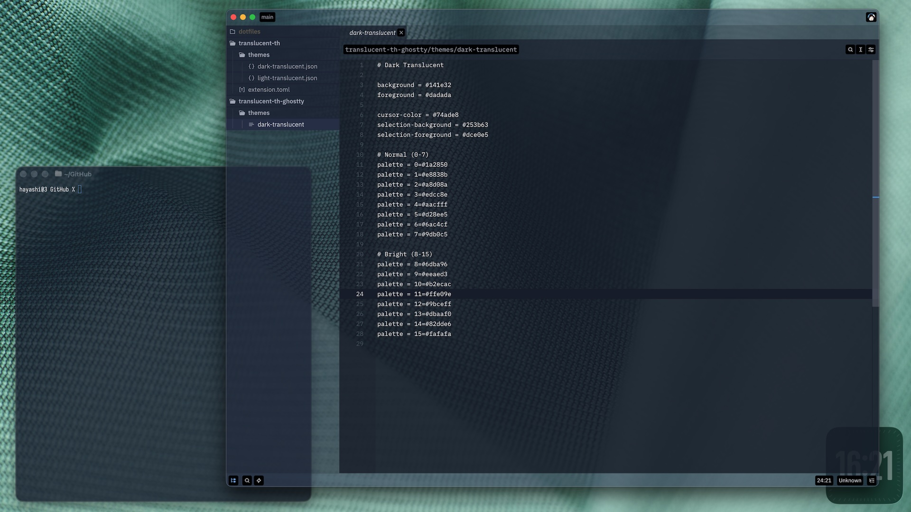

# Translucent Theme for Ghostty

A dark translucent theme for [Ghostty](https://ghostty.org).

## Screenshots



## Installation

Copy `themes/dark-translucent` to your Ghostty themes directory:

```sh
curl -fsSL https://raw.githubusercontent.com/Taro-Hayashi/translucent-th-ghostty/main/themes/dark-translucent \
  -o ~/.config/ghostty/themes/dark-translucent
```

Then add to your `config`:

```
theme = dark-translucent
```

## Enable Transparency

To enable window transparency, add the following to your `config`:

```
background-opacity = 0.8
```
